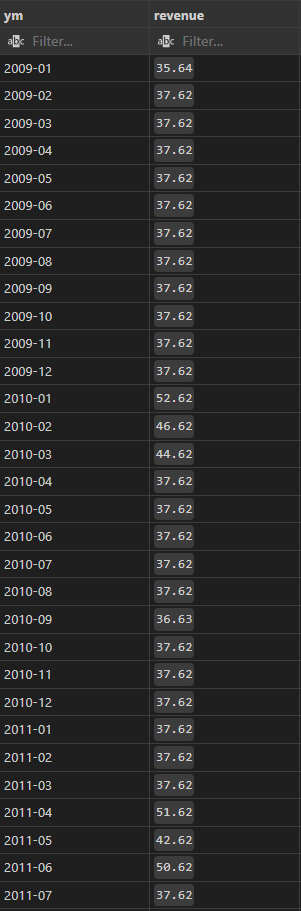
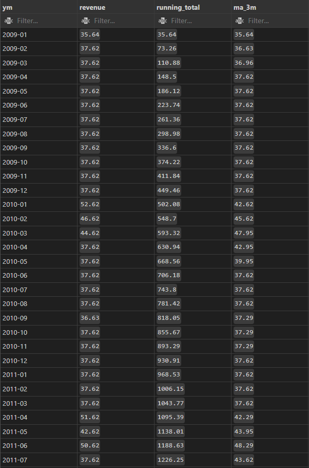
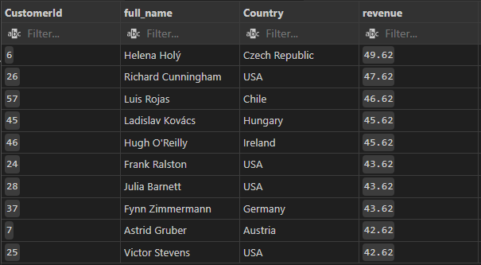
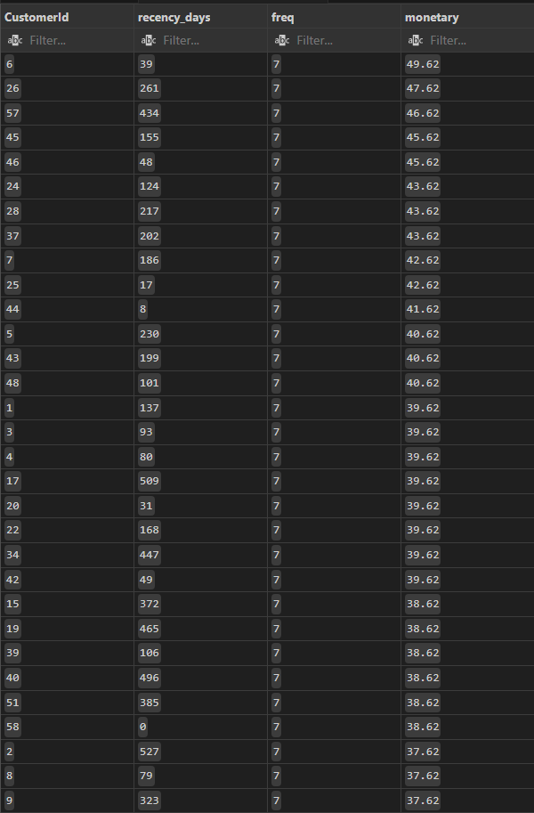
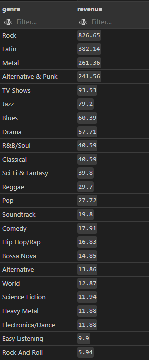

# Chinook – Sales & Customer Insights (SQLite)

This project is a compact, analyst‑friendly SQL portfolio built on the **Chinook** dataset (SQLite).  
It demonstrates executive‑style insights into sales performance, customer behavior, genres/albums, and account management—
using clean SQL (CTEs + window functions) and VS Code (**SQLTools**).

---

## Features
- **Sales Overview**: Monthly revenue trend, running total & 3-month moving average.
- **Customer Insights**: Top 10 customers by revenue, AOV (Average Order Value), RFM (Recency–Frequency–Monetary), potential churn (>180d inactive).
- **Catalog Performance**: Top tracks/albums, revenue by genre, revenue by playlist.
- **Org KPIs**: Employee (Support Rep) performance based on customer revenue.

---

## Tools & Skills Demonstrated
- **SQLite (Chinook)**: Real relational schema (Customer, Invoice, InvoiceLine, Track, Album, Artist, Genre, Employee, Playlist).
- **SQL**: Joins, GROUP BY, CTEs, window functions (running total, moving average, ranking), date operations.
- **Performance hygiene**: Clean query structuring, re-usable CTEs; (optional) indexes.

---

## Files
- `chinook.sqlite` → The Database (download from Chinook/Kaggle and place in the repo root)  
- `chinook_analytics.sql` → Analysis queries 
- `screenshots/` → Images of exported selected results 

---

## How to Run (VS Code + SQLTools)
1. Install extensions: **SQLTools** + **SQLTools SQLite**.  
2. `SQLTools: Manage Connections` → **New Connection** → **SQLite** → select `chinook.sqlite` → **Connect**.  
3. Open `chinook_analytics.sql` → run blocks with `Ctrl+Enter`

---

## Screenshots
### Sales Overview (Monthly Revenue, Running Total & 3‑Month MA)
 

### Customer Insights (Top Customers, RFM)
 
 

### Product Insights (Revenue by Genre)
 

---

## Insights
- **Monthly Revenue:** Revenue typically fluctuates over time; peaks and dips are common and may reflect release cycles, seasonality, or campaigns.
- **Running Total & 3-Month MA:** The cumulative line shows overall growth pace, while the 3-month moving average oscillates between ~36–48, indicating episodic demand rather than a persistent trend.
- **Top Customers:** A small portion of customers  contributes a disproportionately large share of revenue. Prioritizing these accounts can have outsized impact.
- **AOV (Average Order Value):** The AOV is 5.65, providing a baseline ‘typical order size’ to monitor over time; shifts may signal changes in pricing, bundling, or customer mix.
- **RFM:** Customers with high Monetary and recent activity are prime targets for upsell/retention, while long-inactive customers indicate reactivation opportunities.
- **Revenue by Genre:** Revenue is concentrated in Rock, Latin, and Metal, which are the top-performing genres by sales. Curated recommendations and bundles can help monetize the tail.

---

## 👤 Author
Created by **Eleni** | [LinkedIn Profile](https://www.linkedin.com/in/eleniandreikou/)
